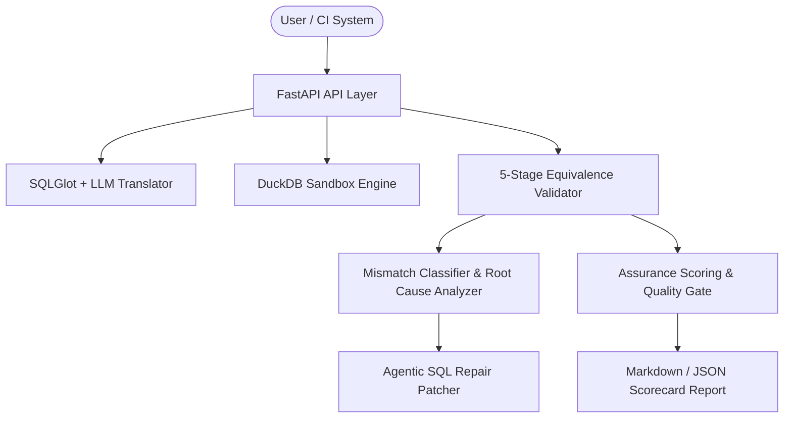

# Migra-Q Architecture Specification

## Overview

Migra-Q is designed as an agentic, modular, and extensible database migration assurance platform. It decouples dialect translation from equivalence validation, diagnosis, and repair.

## Core Subsystems

### 1. Analyzer (`backend/analyzer/`)
Responsible for parsing source & target SQL into sqlglot AST nodes, computing AST node-level diffs, and extracting business predicate rules.

### 2. Execution Engine (`backend/execution/`)
Executes queries safely against embedded in-memory **DuckDB** sandboxes registered with sample data frames, enabling sub-100ms local verification.

### 3. Validation Pipeline (`backend/validation/`)
Runs 5 sequential validation gates:
1. **Schema Check**: Projection alignment and datatype compatibility.
2. **Row Check**: Row count matching & MD5 row hashing.
3. **Aggregate Check**: Numerical invariants (SUM, AVG, MIN, MAX).
4. **Business Rules**: Predicate logical assertions.
5. **Edge Cases**: Null semantics, collation, floating-point precision.

### 4. Diagnosis & Repair Agent (`backend/diagnosis/`, `backend/repair/`)
When a stage fails, the classifier isolates whether it's a schema, null, or join mismatch, and the repair agent synthesizes an AST patch.
