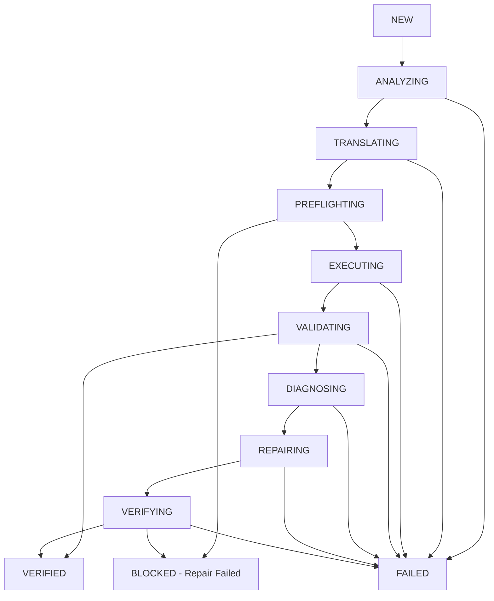

# Architecture & Orchestration

Migra-Q is designed around a strictly orchestrated, multi-stage pipeline. The migration lifecycle consists of nine primary phases, with Schema Preflight acting as a deterministic execution gate between Translation and Execution, and Dialect Adapters serving as a capability bridge to the DuckDB Sandbox.

## The 9-Phase Pipeline

1. **Phase 1: Analyze** - Parses the legacy SQL into an AST, extracts referenced tables/columns, and identifies potential translation risks.
2. **Phase 2: Dataset / Refresh** - Resolves referenced datasets against the schema registry, prioritizing explicitly selected Active Source Candidates, and provisions local DuckDB fixtures.
3. **Phase 3: Translate** - Uses an LLM provider to translate the source SQL into the target dialect candidate.
4. **Phase 4: Execute** - 
   - **Capability Sandbox Analysis**: Analyzes the generic SQLGlot AST (`analyze_and_transform`) using Dialect Compatibility Adapters to bridge proven semantic gaps to DuckDB.
   - **Sandbox Execution**: Sandboxes the execution of both source and target SQL in DuckDB, classifying errors as generic syntax issues, unsupported sandbox capabilities, or signature mismatches.
5. **Phase 5: Validate** - Runs a 5-stage deterministic comparison (Schema, Row, Aggregate, Business Rules, Edge Cases).
6. **Phase 6: Diagnose** - If validation fails, classifies the semantic discrepancy.
7. **Phase 7: Repair** - Synthesizes a patch for the target SQL based on the diagnosis.
8. **Phase 8: Verify** - Re-executes the repaired candidate through the validation engine.
9. **Phase 9: Assure** - Evaluates hard quality gates and calculates a normalized assurance score (0-100). The **Semantic Confidence Contract** ensures migrations relying on unproven AST approximations are gated as `INCONCLUSIVE`, preventing false verifications.

## The State Machine (Decision Tree)

The orchestration is governed by a rigorous state machine (`MigrationStateMachine`). A migration must transition through these states exactly as defined. It cannot arbitrarily skip deterministic execution.

## Hard Gates & Strict Validation

Migra-Q implements **Hard Gates**. These are deterministic checks that immediately halt the pipeline if their invariants are violated:
- **Schema Preflight**: Prevents the execution of SQL if it references columns not present in the dataset schema.
- **Source Candidate Resolution**: Strict explicit resolution order (`Active Source Candidate` → `source_sql_ref` → `record.source_sql`). Will trigger a Hard Failure rather than silently executing a stale or unapproved query.
- **Lineage Integrity**: The system refuses to process an artifact (e.g., Execution result) if its `source_sql_hash` does not strictly match the parent migration.
- **Provider Limits**: If an LLM backend (like Gemini or OpenAI) hits rate limits, the migration transitions to `BLOCKED_PROVIDER_LIMIT`.

## Semantic Confidence & The Assurance Gate

DuckDB acts as an isolated validator, not the ultimate authority on semantic equivalence. 
To prevent the Sandbox from implicitly validating unsafe SQL, Dialect Compatibility Adapters return a strict `SemanticConfidence` classification for transformations:
- `EXACT`
- `SAFE_EQUIVALENT`
- `APPROXIMATION`
- `UNKNOWN`

**The Assurance Gate**: If either the Source or Target execution relies on an `APPROXIMATION` or `UNKNOWN` transformation, the Assurance state will immediately be coerced to `INCONCLUSIVE` (even if row validation succeeded). `VERIFIED` status requires at minimum a `SAFE_EQUIVALENT` classification across the entire AST.

## Database Schema & Execution Sandbox

All migrations are backed by a transactional SQLite state store (`migraq.db`) that persists execution artifacts and logs transitions. However, the actual SQL is executed against **DuckDB** (`migraq.duckdb`), allowing for high-performance, local, in-memory validation of complex analytical queries without mutating enterprise data warehouses.
