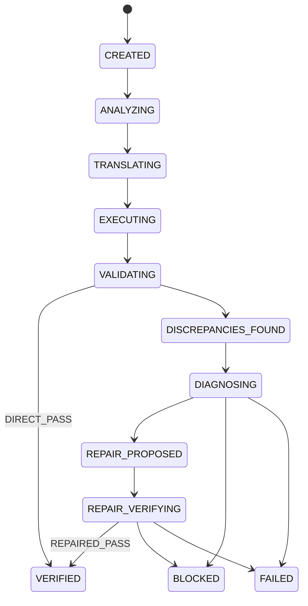

# Phase 9 — Migration Assurance & Audit Decision Layer

## Overview

Phase 9 consumes the complete Phase 1–8 artifact chain and produces a single
**MigrationAssuranceReport** containing: deterministic decision, transparent
assurance score with coverage, hard gates, and complete audit lineage.

**Core principle:**
> The score describes evidence. The gates determine the decision.

## Architecture

```
                PHASE 1–8
               Artifact Chain
                    │
                    ▼
          ┌─────────────────────┐
          │ Phase 9 Assurance   │
          └──────────┬──────────┘
                     │
          ┌──────────┼──────────┐
          ▼          ▼          ▼
       Summaries   Score      Lineage
          │          │          │
          └──────────┼──────────┘
                     ▼
                Hard Gates
                     │
                     ▼
              Final Decision
          ┌──────────┼──────────┐
          ▼          ▼          ▼
       VERIFIED    BLOCKED     FAILED
```

## State Machine



Terminal states: `VERIFIED`, `FAILED`, `BLOCKED`, `ERROR`.

## Hard Gates (11)

| ID | Gate | Outcome when N/A |
|---|---|---|
| GATE-001 | Source execution succeeded | — |
| GATE-002 | Target translation syntactically valid | — |
| GATE-003 | Target execution succeeded | — |
| GATE-004 | No schema mismatch | — |
| GATE-005 | No unresolved CRITICAL discrepancy | — |
| GATE-006 | No new discrepancy after repair | NOT_APPLICABLE |
| GATE-007 | Repair verification VERIFIED | NOT_APPLICABLE |
| GATE-008 | Dataset hash unchanged | NOT_APPLICABLE |
| GATE-009 | Validation config unchanged | NOT_APPLICABLE |
| GATE-010 | Audit lineage complete | — |
| GATE-011 | No unresolved semantic discrepancies | — |

`all_passed = True` iff every gate has outcome `PASS` or `NOT_APPLICABLE`.

## Score Methodology

### Nominal Weights

| Component | Weight | Source |
|---|---|---|
| Schema compatibility | 10% | SchemaValidator |
| Row reconciliation | 30% | RowValidator |
| Aggregate reconciliation | 20% | AggregateValidator |
| Business-rule equivalence | 25% | BusinessRuleValidator |
| Edge-case coverage | 15% | EdgeCaseValidator |

### SKIPPED Handling

**SKIPPED must never be interpreted as PASS.**

```
PASS     → SCORED, use actual score
FAIL     → SCORED, use actual score
SKIPPED  → NOT_APPLICABLE, excluded from denominator
ERROR    → ERROR, score = 0
```

Effective weight = `component_weight / applicable_weight_sum`.

### Report Format

```
ASSURANCE
────────────────────────────
Evidence Score        100.0
Evidence Coverage      75.0%
Hard Gates             11 / 11
Unresolved Issues       0

Final Status
✓ VERIFIED
```

## Decision Policy

Final status is determined by `determine_verified()` — a single deterministic function:

```
VERIFIED iff:
  translation valid
  AND source execution successful
  AND target execution successful
  AND schema valid
  AND zero unresolved discrepancies
  AND no new discrepancies
  AND repair verification passed (if repair occurred)
  AND dataset unchanged (if repair occurred)
  AND validation configuration unchanged (if repair occurred)
  AND audit lineage complete
```

Score NEVER overrides hard gates.

## Verification Paths

### DIRECT_PASS
Clean migration — no discrepancies found. Diagnosis/repair/verification artifacts not required.

### REPAIRED_PASS
Migration required AI-assisted repair. All artifacts from Phase 5–8 required in lineage.
Verified by deterministic re-validation.

## Terminology

- DO NOT use: "AI-approved", "AI-verified", "LLM-approved"
- Use: "Verified by deterministic re-validation" or "Blocked due to unresolved semantic discrepancy"

## Persistence Schema

| Table | Purpose |
|---|---|
| `migrations` | Migration records with state, status, score |
| `migration_state_events` | Immutable state transition events |
| `migration_assurance_reports` | Full assurance report JSON |

## Limitations

1. Evidence coverage may be < 100% when validators are SKIPPED.
2. Score does not account for semantic dimensions not covered by Phase 4 validators.
3. Repair path relies on Phase 7 AI-generated proposals; verified deterministically.
